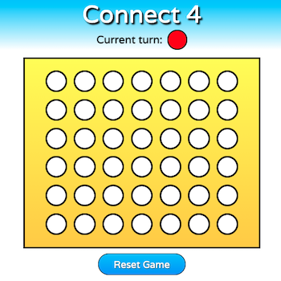

# Connect 4 with React

Classic game built with Express, React, and Node js.

## Setup:

1. `git clone`
1. install dependencies with `npm install`
1. start server with `npm run start`
1. build bundle with `npm run build`
1. verify app up and running at `localhost:3000`
1. for development, start webpack with `npm run react-dev`
